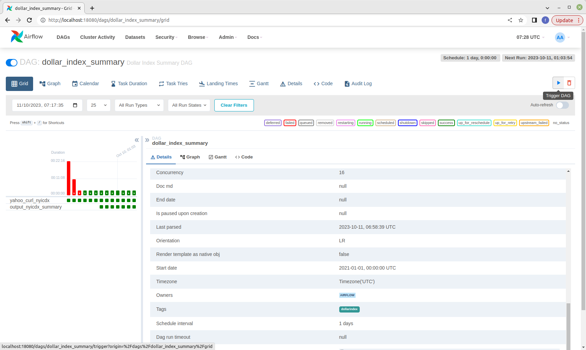
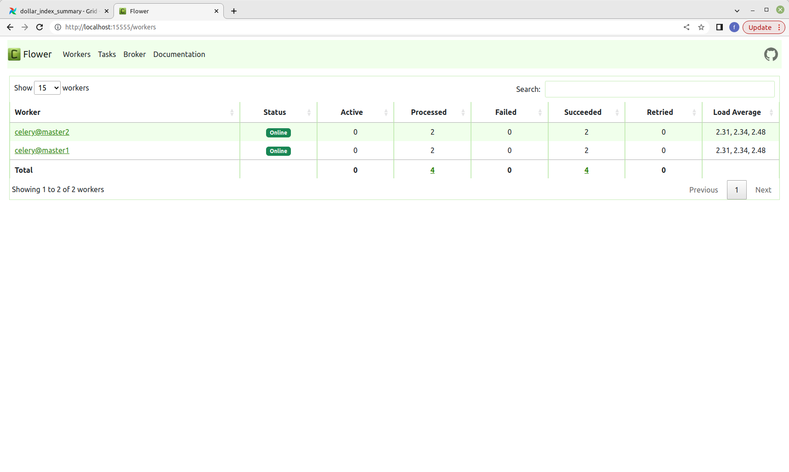
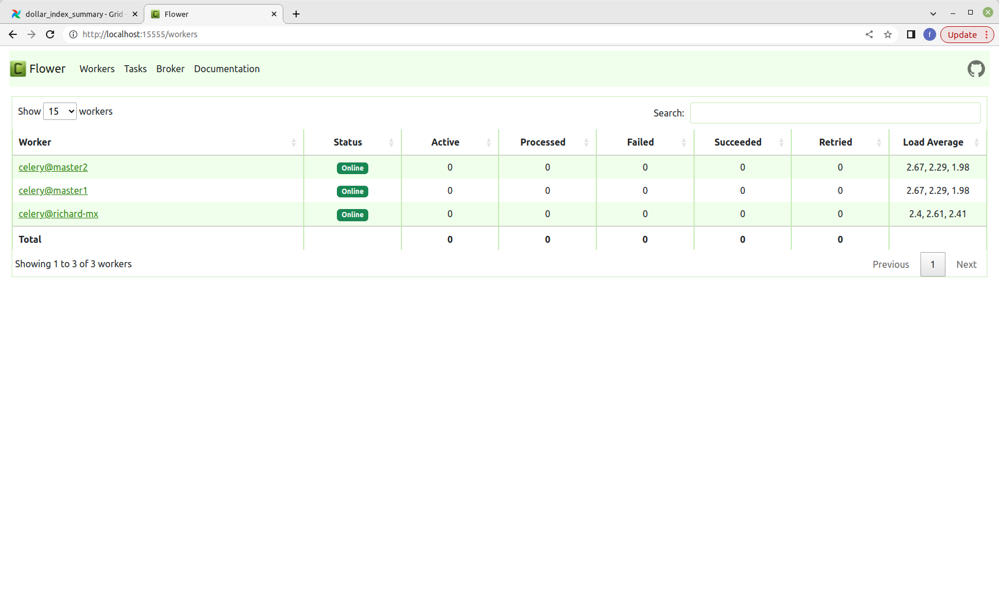

# airflowclusterdemo masternode

Steps to setup
-------------
1. Prepare env_var file and put this under the parent folder. For detail you can refer to env_var_example.txt 
2. Init project dir, please run **./init_project_dir.sh** and you will be able to see the following folders created
```
richard@richard-linux:$ ls -l /mnt/airflow/cluster1/
total 0
drwxr-xr-x 2 root root 0 Oct 10 21:22 config
drwxr-xr-x 2 root root 0 Oct 10 21:27 dags
drwxr-xr-x 2 root root 0 Oct 10 21:31 logs
drwxr-xr-x 2 root root 0 Oct 10 21:22 plugins
drwxr-xr-x 2 root root 0 Oct 10 21:31 taskout
```
dags - required dag files will be found
taskout - output files from different jobs will be found

3. Build docker images for master node and deploy dags. Images will be built and dags required files will be copied to <shared_drive>/dags
```
Building airflow-init
[+] Building 15.7s (8/8) FINISHED                                                                                                                                                                      docker:default
 => [internal] load .dockerignore                                                                                                                                                                                0.0s
 => => transferring context: 2B                                                                                                                                                                                  0.0s
 => [internal] load build definition from Dockerfile                                                                                                                                                             0.0s
 => => transferring dockerfile: 178B                                                                                                                                                                             0.0s
 => [internal] load metadata for docker.io/apache/airflow:2.7.1                                                                                                                                                  0.0s
 => [internal] load build context                                                                                                                                                                                0.0s
 => => transferring context: 37B                                                                                                                                                                                 0.0s
 => [1/3] FROM docker.io/apache/airflow:2.7.1                                                                                                                                                                    0.2s
 => [2/3] COPY requirements.txt /                                                                                                                                                                                0.0s
 => [3/3] RUN pip install --no-cache-dir "apache-airflow==2.7.1" -r /requirements.txt                                                                                                                           15.3s
 => exporting to image                                                                                                                                                                                           0.1s
 => => exporting layers                                                                                                                                                                                          0.0s
 => => writing image sha256:ebee3fb8908ee11e2794cd5e5bf45c56ca2fda69bdbaf039ed098ada26ff16a7                                                                                                                     0.0s
 => => naming to docker.io/apache/airflow:2.7.1                                                                                                                                                                  0.0s
Building airflow-triggerer                                                                                                                                                                                            
[+] Building 15.8s (8/8) FINISHED                                                                                                                                                                      docker:default 
 => [internal] load build definition from Dockerfile                                                                                                                                                             0.0s
 => => transferring dockerfile: 178B                                                                                                                                                                             0.0s
 => [internal] load .dockerignore                                                                                                                                                                                0.0s
 => => transferring context: 2B                                                                                                                                                                                  0.0s
 => [internal] load metadata for docker.io/apache/airflow:2.7.1                                                                                                                                                  0.0s
 => [internal] load build context                                                                                                                                                                                0.0s
 => => transferring context: 37B                                                                                                                                                                                 0.0s
 => [1/3] FROM docker.io/apache/airflow:2.7.1                                                                                                                                                                    0.2s
 => [2/3] COPY requirements.txt /                                                                                                                                                                                0.1s
 => [3/3] RUN pip install --no-cache-dir "apache-airflow==2.7.1" -r /requirements.txt                                                                                                                           15.4s
 => exporting to image                                                                                                                                                                                           0.1s 
 => => exporting layers                                                                                                                                                                                          0.0s 
 => => writing image sha256:0fa4d9f6a7d3278f668649efc960fc9dc319c185a5ea207dac112320362a7887                                                                                                                     0.0s 
 => => naming to docker.io/apache/airflow:2.7.1                                                                                                                                                                  0.0s 
Building airflow-worker2                                                                                                                                                                                              
[+] Building 13.2s (8/8) FINISHED                                                                                                                                                                      docker:default 
 => [internal] load .dockerignore                                                                                                                                                                                0.0s
 => => transferring context: 2B                                                                                                                                                                                  0.0s
 => [internal] load build definition from Dockerfile                                                                                                                                                             0.0s
 => => transferring dockerfile: 178B                                                                                                                                                                             0.0s
 => [internal] load metadata for docker.io/apache/airflow:2.7.1                                                                                                                                                  0.0s
 => [internal] load build context                                                                                                                                                                                0.0s
 => => transferring context: 37B                                                                                                                                                                                 0.0s
 => [1/3] FROM docker.io/apache/airflow:2.7.1                                                                                                                                                                    0.2s
 => [2/3] COPY requirements.txt /                                                                                                                                                                                0.0s
 => [3/3] RUN pip install --no-cache-dir "apache-airflow==2.7.1" -r /requirements.txt                                                                                                                           12.9s
 => exporting to image                                                                                                                                                                                           0.0s 
 => => exporting layers                                                                                                                                                                                          0.0s 
 => => writing image sha256:db2118478fdf1c3fe02f00934cfae852829bed13064bbe7233eec0728fcdb9da                                                                                                                     0.0s 
 => => naming to docker.io/apache/airflow:2.7.1                                                                                                                                                                  0.0s 
Building airflow-worker                                                                                                                                                                                               
[+] Building 14.3s (8/8) FINISHED                                                                                                                                                                      docker:default 
 => [internal] load .dockerignore                                                                                                                                                                                0.0s
 => => transferring context: 2B                                                                                                                                                                                  0.0s
 => [internal] load build definition from Dockerfile                                                                                                                                                             0.0s
 => => transferring dockerfile: 178B                                                                                                                                                                             0.0s
 => [internal] load metadata for docker.io/apache/airflow:2.7.1                                                                                                                                                  0.0s
 => [internal] load build context                                                                                                                                                                                0.0s
 => => transferring context: 37B                                                                                                                                                                                 0.0s
 => [1/3] FROM docker.io/apache/airflow:2.7.1                                                                                                                                                                    0.2s
 => [2/3] COPY requirements.txt /                                                                                                                                                                                0.0s
 => [3/3] RUN pip install --no-cache-dir "apache-airflow==2.7.1" -r /requirements.txt                                                                                                                           14.0s
 => exporting to image                                                                                                                                                                                           0.1s
 => => exporting layers                                                                                                                                                                                          0.0s
 => => writing image sha256:e068ca6bec9eeb290f80e7b790ae8940f5c09f2c3731a2e339b81d87baeb5229                                                                                                                     0.0s
 => => naming to docker.io/apache/airflow:2.7.1                                                                                                                                                                  0.0s
Building airflow-scheduler                                                                                                                                                                                            
[+] Building 15.1s (8/8) FINISHED                                                                                                                                                                      docker:default 
 => [internal] load build definition from Dockerfile                                                                                                                                                             0.0s
 => => transferring dockerfile: 178B                                                                                                                                                                             0.0s
 => [internal] load .dockerignore                                                                                                                                                                                0.0s
 => => transferring context: 2B                                                                                                                                                                                  0.0s
 => [internal] load metadata for docker.io/apache/airflow:2.7.1                                                                                                                                                  0.0s
 => [internal] load build context                                                                                                                                                                                0.0s
 => => transferring context: 37B                                                                                                                                                                                 0.0s
 => [1/3] FROM docker.io/apache/airflow:2.7.1                                                                                                                                                                    0.2s
 => [2/3] COPY requirements.txt /                                                                                                                                                                                0.0s
 => [3/3] RUN pip install --no-cache-dir "apache-airflow==2.7.1" -r /requirements.txt                                                                                                                           14.7s
 => exporting to image                                                                                                                                                                                           0.0s
 => => exporting layers                                                                                                                                                                                          0.0s
 => => writing image sha256:acc0049afe116fcaf88629eac79f1005b28329fb830447aef1ae2c35fcf8f05c                                                                                                                     0.0s 
 => => naming to docker.io/apache/airflow:2.7.1                                                                                                                                                                  0.0s 
Building airflow-webserver                                                                                                                                                                                            
[+] Building 19.3s (8/8) FINISHED                                                                                                                                                                      docker:default 
 => [internal] load build definition from Dockerfile                                                                                                                                                             0.0s
 => => transferring dockerfile: 178B                                                                                                                                                                             0.0s
 => [internal] load .dockerignore                                                                                                                                                                                0.0s
 => => transferring context: 2B                                                                                                                                                                                  0.0s
 => [internal] load metadata for docker.io/apache/airflow:2.7.1                                                                                                                                                  0.0s
 => [internal] load build context                                                                                                                                                                                0.0s
 => => transferring context: 37B                                                                                                                                                                                 0.0s
 => [1/3] FROM docker.io/apache/airflow:2.7.1                                                                                                                                                                    0.2s
 => [2/3] COPY requirements.txt /                                                                                                                                                                                0.0s
 => [3/3] RUN pip install --no-cache-dir "apache-airflow==2.7.1" -r /requirements.txt                                                                                                                           14.7s
 => exporting to image                                                                                                                                                                                           0.1s
 => => exporting layers                                                                                                                                                                                          0.0s
 => => writing image sha256:84ec9cf9b1603e55a6c07bd5fc0aa3877a390ad2e66c4dea96bf1abb187f729a                                                                                                                     0.0s
 => => naming to docker.io/apache/airflow:2.7.1
```

```
richard@richard-linux:$ ls -l /mnt/shared_doc/document/J2EE/airflow/cluster1/dags
total 20
-rwxr-xr-x 1 root root  699 Oct 11 13:45 analyze.py
-rwxr-xr-x 1 root root 3383 Oct 11 13:45 dollarindexsummary.py
-rwxr-xr-x 1 root root 4819 Oct 11 13:45 usindexsummary.py
-rwxr-xr-x 1 root root 2387 Oct 11 13:45 yahoo_finance_data.sh
```

Run the node
--------
Run **./run.sh** command 
```
./run.sh 
```

or 
```
docker compose --env-file env_var --profile flower up -d
```

Remarks: Older docker version does not support "docker compose". If that is the case please use "docker-compose"

The following will be seen:
```
Creating network "masternode_default" with the default driver
Creating masternode_redis_1    ... done
Creating masternode_postgres_1 ... done
Creating masternode_airflow-init_1 ... done
Creating masternode_flower_1            ... done
Creating masternode_airflow-worker2_1   ... done
Creating masternode_airflow-webserver_1 ... done
Creating masternode_airflow-scheduler_1 ... done
Creating masternode_airflow-worker_1    ... done
Creating masternode_airflow-triggerer_1 ... done
```

Once the node is started we can run **./healthcheck.sh**
```
./healthcheck.sh
```

and see
```
{"dag_processor": {"latest_dag_processor_heartbeat": null, "status": null}, "metadatabase": {"status": "healthy"}, "scheduler": {"latest_scheduler_heartbeat": "2023-10-11T06:33:05.042532+00:00", "status": "healthy"}, "triggerer": {"latest_triggerer_heartbeat": "2023-10-11T06:33:06.029908+00:00", "status": "healthy"}}
```

Login webserver
----------
Browse 
```
http://localhost:18080/login/
```
and you will see:


login with username **airflow** and password **airflow**

After successful login you should see home screen with DAGs 


Unpause Dags
----------
If you see DAG(s) is being paused, you can unpause through the screen


Run Dags
--------
There are two ways to trigger the run of dag, either from screen or command
Screen


Or command mode **./run_dag.sh <dag_id>**:
```
./run_dag.sh <dag_id>

richard@richard-linux:$ ./run_dag.sh dollar_index_summary
{
  "conf": {},
  "dag_id": "dollar_index_summary",
  "dag_run_id": "dollar_index_summary_2023101115351697009720",
  "data_interval_end": "2023-10-11T07:35:21.150449+00:00",
  "data_interval_start": "2023-10-10T07:35:21.150449+00:00",
  "end_date": null,
  "execution_date": "2023-10-11T07:35:21.150449+00:00",
  "external_trigger": true,
  "last_scheduling_decision": null,
  "logical_date": "2023-10-11T07:35:21.150449+00:00",
  "note": null,
  "run_type": "manual",
  "start_date": null,
  "state": "queued"
}
```

and we can check the status from command **./check_run_dag.sh**:
```
./check_run_dag.sh <dag_id> <dag_run_id>

richard@richard-linux:$ ./check_run_dag.sh dollar_index_summary dollar_index_summary_2023101115351697009720
{
  "conf": {},
  "dag_id": "dollar_index_summary",
  "dag_run_id": "dollar_index_summary_2023101115351697009720",
  "data_interval_end": "2023-10-11T07:35:21.150449+00:00",
  "data_interval_start": "2023-10-10T07:35:21.150449+00:00",
  "end_date": "2023-10-11T07:35:26.914152+00:00",
  "execution_date": "2023-10-11T07:35:21.150449+00:00",
  "external_trigger": true,
  "last_scheduling_decision": "2023-10-11T07:35:26.911434+00:00",
  "logical_date": "2023-10-11T07:35:21.150449+00:00",
  "note": null,
  "run_type": "manual",
  "start_date": "2023-10-11T07:35:21.233603+00:00",
  "state": "success"
}
```

List Dags from command line
----------
From home screen we can see dags displayed. At the same time we can run command **./list_dags.sh** to list dags:
```
./list_dags.sh

{
  "dags": [
    {
      "dag_id": "dollar_index_summary",
      "default_view": "grid",
      "description": "Dollar Index Summary DAG",
      "file_token": "Ii9vcHQvYWlyZmxvdy9kYWdzL2RvbGxhcmluZGV4c3VtbWFyeS5weSI.6xLWRjMkgNZK3Tdr9_ZKjx5xCC4",
      "fileloc": "/opt/airflow/dags/dollarindexsummary.py",
      "has_import_errors": false,
      "has_task_concurrency_limits": false,
      "is_active": true,
      "is_paused": false,
      "is_subdag": false,
      "last_expired": null,
      "last_parsed_time": "2023-10-11T07:53:23.122500+00:00",
      "last_pickled": null,
      "max_active_runs": 16,
      "max_active_tasks": 16,
      "next_dagrun": "2023-10-11T01:03:54.348157+00:00",
      "next_dagrun_create_after": "2023-10-12T01:03:54.348157+00:00",
      "next_dagrun_data_interval_end": "2023-10-12T01:03:54.348157+00:00",
      "next_dagrun_data_interval_start": "2023-10-11T01:03:54.348157+00:00",
      "owners": [
        "airflow"
      ],
      "pickle_id": null,
      "root_dag_id": null,
      "schedule_interval": {
        "__type": "TimeDelta",
        "days": 1,
        "microseconds": 0,
        "seconds": 0
      },
      "scheduler_lock": null,
      "tags": [
        {
          "name": "dollarindex"
        }
      ],
      "timetable_description": ""
    },
    {
      "dag_id": "usindexconsuming",
      "default_view": "grid",
      "description": null,
      "file_token": "Ii9vcHQvYWlyZmxvdy9kYWdzL3VzaW5kZXhzdW1tYXJ5LnB5Ig.F3PsFF3KgdrT4K0tUjmolZ69iPM",
      "fileloc": "/opt/airflow/dags/usindexsummary.py",
      "has_import_errors": false,
      "has_task_concurrency_limits": false,
      "is_active": true,
      "is_paused": false,
      "is_subdag": false,
      "last_expired": null,
      "last_parsed_time": "2023-10-11T07:53:23.135369+00:00",
      "last_pickled": null,
      "max_active_runs": 16,
      "max_active_tasks": 16,
      "next_dagrun": null,
      "next_dagrun_create_after": null,
      "next_dagrun_data_interval_end": null,
      "next_dagrun_data_interval_start": null,
      "owners": [
        "airflow"
      ],
      "pickle_id": null,
      "root_dag_id": null,
      "schedule_interval": {
        "__type": "CronExpression",
        "value": "Dataset"
      },
      "scheduler_lock": null,
      "tags": [
        {
          "name": "usindex"
        },
        {
          "name": "consumes"
        }
      ],
      "timetable_description": "Triggered by datasets"
    },
    {
      "dag_id": "usindexsourcing",
      "default_view": "grid",
      "description": null,
      "file_token": "Ii9vcHQvYWlyZmxvdy9kYWdzL3VzaW5kZXhzdW1tYXJ5LnB5Ig.F3PsFF3KgdrT4K0tUjmolZ69iPM",
      "fileloc": "/opt/airflow/dags/usindexsummary.py",
      "has_import_errors": false,
      "has_task_concurrency_limits": false,
      "is_active": true,
      "is_paused": false,
      "is_subdag": false,
      "last_expired": null,
      "last_parsed_time": "2023-10-11T07:53:23.139857+00:00",
      "last_pickled": null,
      "max_active_runs": 16,
      "max_active_tasks": 16,
      "next_dagrun": "2023-10-11T00:00:00+00:00",
      "next_dagrun_create_after": "2023-10-12T00:00:00+00:00",
      "next_dagrun_data_interval_end": "2023-10-12T00:00:00+00:00",
      "next_dagrun_data_interval_start": "2023-10-11T00:00:00+00:00",
      "owners": [
        "airflow"
      ],
      "pickle_id": null,
      "root_dag_id": null,
      "schedule_interval": {
        "__type": "CronExpression",
        "value": "@daily"
      },
      "scheduler_lock": null,
      "tags": [
        {
          "name": "produces"
        },
        {
          "name": "usindex"
        }
      ],
      "timetable_description": "At 00:00"
    }
  ],
  "total_entries": 3
}

```

Flower Screen
----------
There is a component called "Flower" to monitor the processing nodes. In our setting we have two internal master nodes dedicated on processing dags. Also another node from worker will be seen if it is online. Browse 
```
http://localhost:15555/workers
```

Master node only (master1 & master2 only)


Master and Work nodes (master1, master2 and richard-mx)


Tear down the node
----------
Run **docker compose down** to stop and tear down the node
