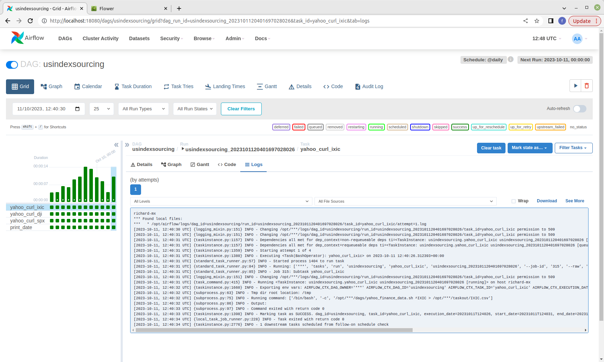
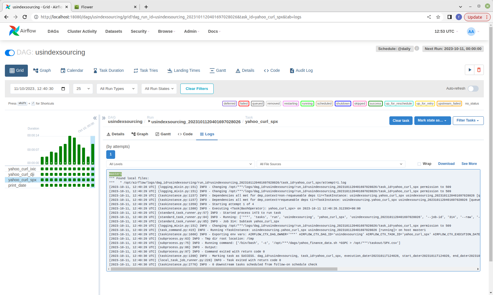
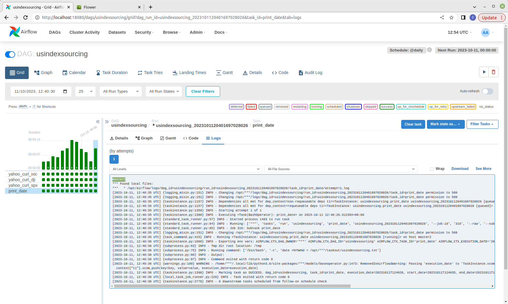

# Test Cases
In this document we want to verify the features to be available in this airflow cluster

## 1. Trigger a DAG and different nodes collaborate to complete successfully
1. trigger usindexsourcing and a new dag_run_id is expected to be queued
Result:
```
richard@richard-linux:$ ./run_dag.sh usindexsourcing
{
  "conf": {},
  "dag_id": "usindexsourcing",
  "dag_run_id": "usindexsourcing_2023101120401697028026",
  "data_interval_end": "2023-10-11T00:00:00+00:00",
  "data_interval_start": "2023-10-10T00:00:00+00:00",
  "end_date": null,
  "execution_date": "2023-10-11T12:40:26.312393+00:00",
  "external_trigger": true,
  "last_scheduling_decision": null,
  "logical_date": "2023-10-11T12:40:26.312393+00:00",
  "note": null,
  "run_type": "manual",
  "start_date": null,
  "state": "queued"
}
``` 
2. Wait for 15 seconds and check the status of dag_run_id. The status is expected to be **success**
Result:
```
richard@richard-linux-mint:~/airflowclusterdemo/masternode$ ./check_run_dag.sh usindexsourcing usindexsourcing_2023101120401697028026
{
  "conf": {},
  "dag_id": "usindexsourcing",
  "dag_run_id": "usindexsourcing_2023101120401697028026",
  "data_interval_end": "2023-10-11T00:00:00+00:00",
  "data_interval_start": "2023-10-10T00:00:00+00:00",
  "end_date": "2023-10-11T12:40:37.104410+00:00",
  "execution_date": "2023-10-11T12:40:26.312393+00:00",
  "external_trigger": true,
  "last_scheduling_decision": "2023-10-11T12:40:37.101388+00:00",
  "logical_date": "2023-10-11T12:40:26.312393+00:00",
  "note": null,
  "run_type": "manual",
  "start_date": "2023-10-11T12:40:26.823215+00:00",
  "state": "success"
}

```
3. There are different tasks and **master1**, **master2** and **richard-mx** nodes to be seen in the log
Result:
Task **yahoo_curl_ixic** by **richard-mx**


Task **yahoo_curl_dji** by **master2**


Task **yahoo_curl_spx** by **master1**


Task **print_date** by **master2**

